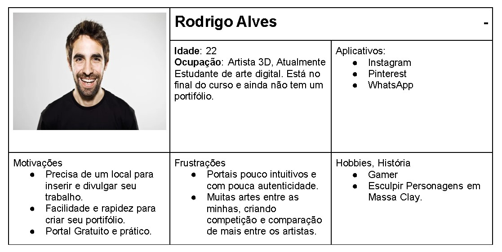

# Especificações do Projeto

A definição exata do problema e os pontos mais relevantes a serem tratados neste projeto foi consolidada com a participação dos usuários em um trabalho de imersão feito pelos membros da equipe a partir da observação dos usuários em seu local natural e por meio de entrevistas. Os detalhes levantados nesse processo foram consolidados na forma de personas e histórias de usuários.

## Personas

Baseadas em dados sobre comportamentos e características dos clientes, as personas são representações fictícias do público-alvo de um negócio. Assim, são personagens criados para simular um cliente ideal.

## Histórias de Usuários

|EU COMO... `PERSONA`     | QUERO/PRECISO ... `FUNCIONALIDADE`                                  |PARA ... `MOTIVO/VALOR`                                              |
|-------------------------|---------------------------------------------------------------------|---------------------------------------------------------------------|
|Rodrigo Alves            | Ter um local gratuito para inserir suas artes                  | Enviar seus trabalhos para empresas e conseguir um emprego.
|Silvia Geaninne          | Conseguir visualizar melhor as artes de seus candidatos        | Decidir entre eles quais se adequam melhor ao cargo.                                     |
|Geraldo Gomes            | Incluir videos com animações                                   | Para ser mais didatico e conseguir ajudar outros artistas que querem chegar ao nivel dele.
|Samira Oliveira          | Organizar tudo da forma dela                                   | Mais autenticidade em seu portifólio.

## Requisitos

As tabelas que se seguem apresentam os requisitos funcionais e não funcionais que detalham o escopo do projeto.

### Requisitos Funcionais

|ID    | Descrição do Requisito                                                                                  | Prioridade |
|------|---------------------------------------------------------------------------------------------------------|------------|
|RF-001| O Site deve permitir o usuário a criar várias abas com diferentes paginas de portifólio.                                                   | Média     | 
|RF-002| O Site deverá ter um campo de pesquisa por nome de arte e/ou por nome de usuário.                                                   | Média     |
|RF-003| O Site deverá ter um sistema de cadastro de usuários   | Alta      |
|RF-004| O Site deverá ter o acesso publico ou privado nas paginas de portifólios, a critério do usuário.                                      | Baixa     |
|RF-005| O site deverá conter um sistema de Login e logout do Usuário.                                            | Alta      |
|RF-006| O site deverá fornecer uma ferramenta de criação de portifólio autentica, que da ao usuário o acesso a modificação da interface de cada página.                                    | Alta      |
|RF-007| O site deve permitir que o usuário remova e edite seus portifólios.                                         | Alta      |
|RF-008| O site deve permitir a incersão de imagens, texto e videos em portifólios.                                                   | Média     | 

### Requisitos não Funcionais

|ID     | Descrição do Requisito  |Prioridade |
|-------|-------------------------|----|
|RNF-001| O site deve ser responsivo para rodar em um dispositivos móvel | Média | 
|RNF-002| O site Deve processar requisições do usuário em no máximo 3s |  Baixa | 
|RNF-003| O site deve ser publicado em um ambiente acessível publicamente na Internet (Repl.it, GitHub Pages, Azure) |  Alta | 
|RNF-004| O site deve ter bom nível de contraste entre os elementos da tela em conformidade. |  Média |
|RNF-005| O site deve ser compatível com os principais navegadores do mercado (Google Chrome, Firefox, Microsoft Edge) |  Média |

## Restrições

O projeto está restrito pelos itens apresentados na tabela a seguir.

|ID| Restrição                                                              |
|--|------------------------------------------------------------------------|
|01| Cada um poderá ter até no máximo de 10 paginas de portifólio           |
|02| Deverá disponibilizar uma quantidade limite para inserção de arquivos. |

## Diagrama de Casos de Uso

